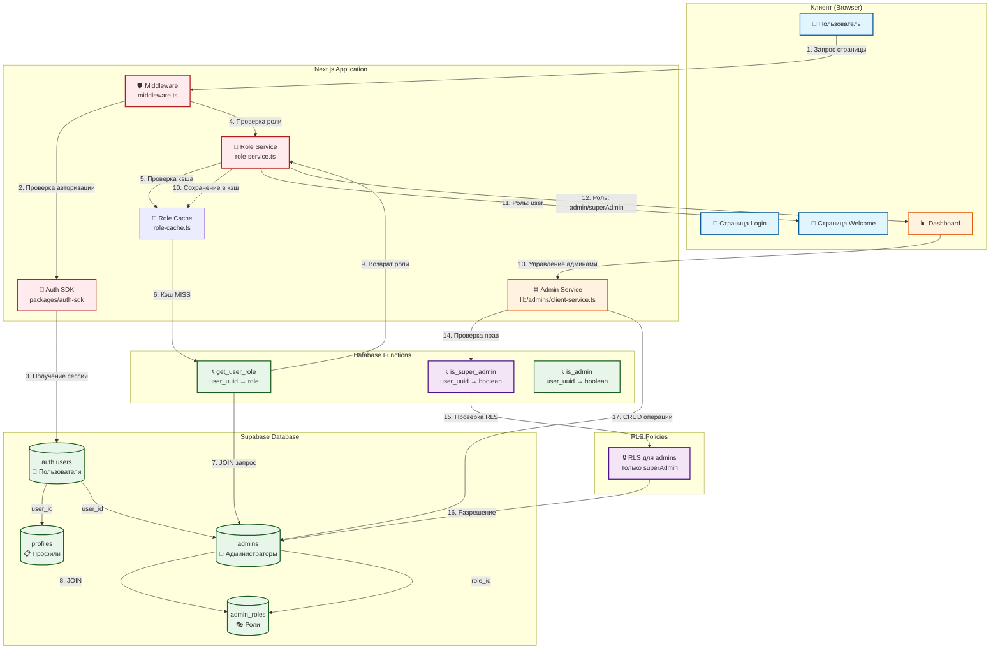
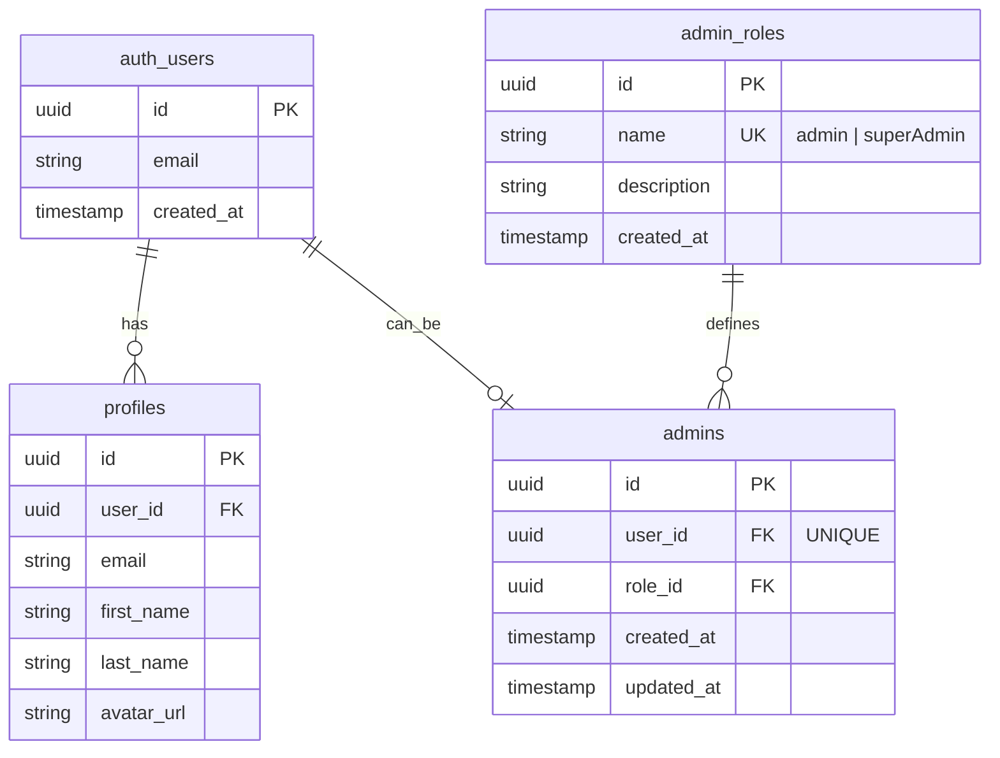
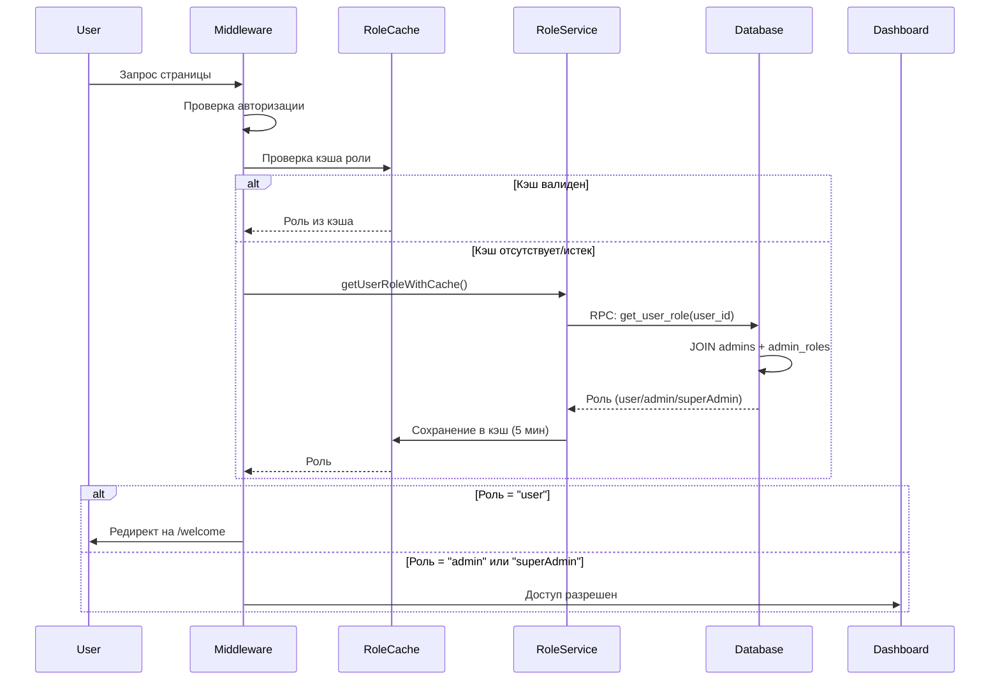
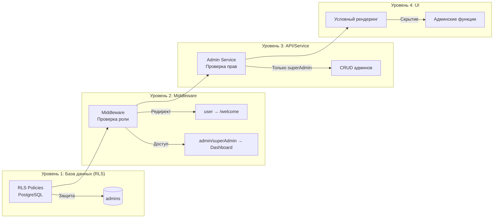
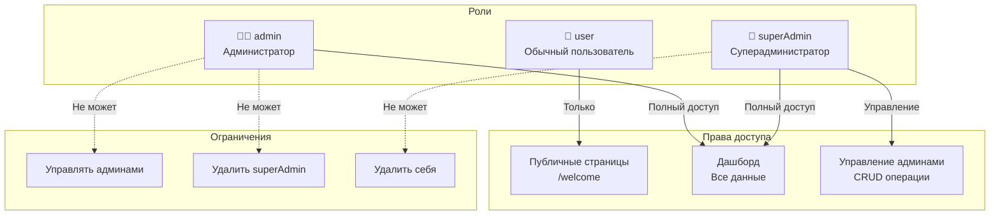
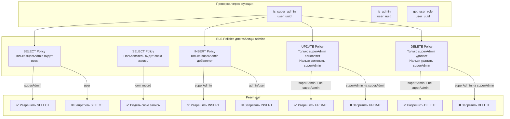
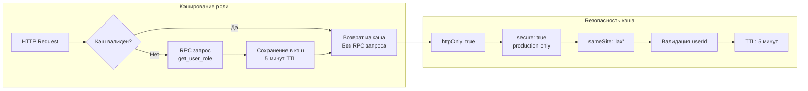
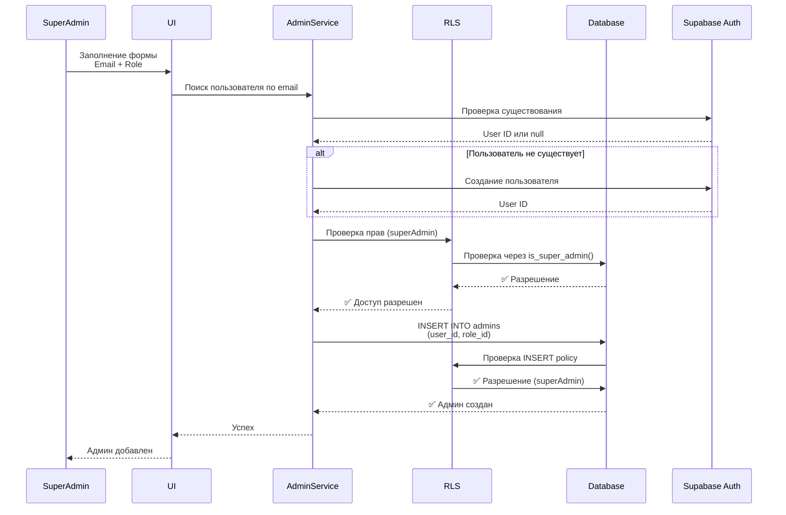

# Архитектура системы администраторов админпанели

## 📊 Визуализация архитектуры

## 🏗️ Структура базы данных

## 🔄 Поток проверки роли

## 🛡️ Уровни защиты

## 👥 Роли и права доступа

## 📋 Детальная схема работы RLS

## 🔐 Безопасность и кэширование

## 📝 Ключевые компоненты

### 1. **База данных**

- `auth.users` - пользователи Supabase Auth
- `profiles` - профили пользователей
- `admin_roles` - роли (admin, superAdmin)
- `admins` - связь пользователей с ролями

### 2. **Database Functions**

- `get_user_role(user_uuid)` - получение роли пользователя
- `is_super_admin(user_uuid)` - проверка суперадмина
- `is_admin(user_uuid)` - проверка админа

### 3. **RLS Policies**

- Только `superAdmin` может управлять админами
- Защита от удаления/изменения `superAdmin`
- Пользователь может видеть свою запись в `admins`

### 4. **Middleware**

- Проверка авторизации
- Проверка роли с кэшированием
- Редирект `user` → `/welcome`
- Доступ `admin`/`superAdmin` → Dashboard

### 5. **Role Service**

- `getUserRole()` - получение роли из БД
- `getUserRoleWithCache()` - получение с кэшированием
- `isAdmin()` - проверка админа
- `isSuperAdmin()` - проверка суперадмина
- `canManageAdmins()` - проверка прав управления

### 6. **Role Cache**

- Кэширование роли в httpOnly cookie
- TTL: 5 минут
- Валидация по userId
- Автоматическая очистка при logout

### 7. **Admin Service**

- `getAdminsFromClient()` - получение списка админов
- `createAdminFromClient()` - создание админа
- `deleteAdminFromClient()` - удаление админа
- Проверка прав через RLS

## 🚀 Поток создания админа

## 📊 Статистика и мониторинг

- **Кэш попаданий**: Логирование HIT/MISS
- **RPC запросы**: Минимизация через кэш
- **RLS проверки**: Автоматические на уровне БД
- **Время ответа**: Оптимизация через кэширование

---

**Дата создания**: 2025-01-30  
**Версия**: 1.0
