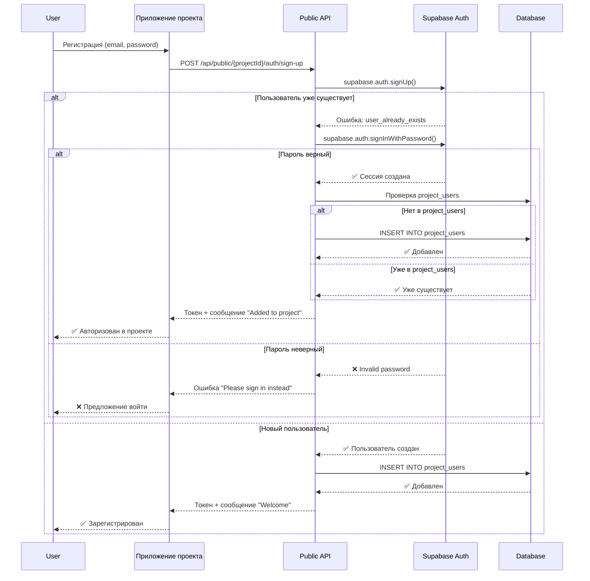

# План рефакторинга системы администраторов

## 📋 Анализ текущей ситуации

### ❌ Проблема 1: Почему admin не видит список админов?

**Текущая ситуация:**

- RLS политика `"Only super admins can view admins"` (строка 76-79 в миграции)
- Проверка: `public.is_super_admin(auth.uid())`
- Результат: только `superAdmin` может видеть таблицу `admins`
- Обычный `admin` **не может** видеть список админов

**Причина:**

```sql
CREATE POLICY "Only super admins can view admins"
  ON public.admins
  FOR SELECT
  USING (public.is_super_admin(auth.uid()));  -- Только superAdmin!
```

**Решение (временное, до рефакторинга):**

- Изменить политику, чтобы `admin` тоже мог видеть список (но не управлять)

---

## 🎯 Требования к новой архитектуре

### 1. Новая система ролей

#### Глобальные роли (системные):

- **`superAdmin`** - суперадмин системы
  - Полный доступ ко всем проектам
  - Может управлять всеми админами (включая себя)
  - Может удалить любого, включая других superAdmin
  - Может управлять projectSuperAdmin и projectAdmin

#### Роли на уровне проекта:

- **`projectSuperAdmin`** - суперадмин проекта

  - Полный доступ к данным проекта
  - Может управлять админами проекта (projectAdmin, projectSuperAdmin)
  - Может управлять структурой данных проекта (entity_definition)
  - Может управлять универсальными сущностями

- **`projectAdmin`** - админ проекта
  - Может управлять только универсальными сущностями проекта
  - **НЕ может** управлять структурой данных (entity_definition)
  - **НЕ может** управлять админами проекта

### 2. Связь админов с проектами

**Требования:**

- Один пользователь может быть админом в нескольких проектах
- Один пользователь может иметь разные роли в разных проектах
- SuperAdmin видит все проекты
- ProjectSuperAdmin/ProjectAdmin видят только свои проекты

### 3. Управление админами проекта

**Кто может управлять:**

- `superAdmin` - может управлять админами во всех проектах
- `projectSuperAdmin` - может управлять админами только своего проекта

**Операции:**

- Создание админа проекта (projectAdmin или projectSuperAdmin)
- Удаление админа проекта
- Изменение роли админа проекта
- Просмотр списка админов проекта

**Ограничения:**

- SuperAdmin может удалить любого, включая себя
- ProjectSuperAdmin может удалить только админов своего проекта
- ProjectSuperAdmin **не может** удалить себя (только superAdmin может)

### 4. Доступ к данным проекта

**Правила:**

- SuperAdmin → доступ ко всем проектам
- ProjectSuperAdmin → полный доступ к своему проекту
- ProjectAdmin → доступ только к универсальным сущностям (не к entity_definition)

---

## 🔐 Критический вопрос: Пользователи приложений проектов

### Проблема

**Сценарий:**

1. У нас есть админ-панель (одна на все проекты)
2. У каждого проекта есть свое приложение (магазин, блог, и т.д.)
3. Пользователи регистрируются в приложениях проектов
4. Пользователи приложений ≠ админы админ-панели

**Вопросы:**

1. Где хранить пользователей приложений?
2. Как разделить пользователей админки и пользователей приложений?
3. Нужна ли отдельная таблица `project_users` для каждого проекта?
4. Как работает авторизация в приложениях проектов?

### Варианты решения

#### Вариант 1: Единая таблица auth.users + project_users

**Архитектура:**

```
auth.users (Supabase Auth)
  ├─ Админы админ-панели → admins (глобальные) или project_admins (проектные)
  └─ Пользователи приложений → project_users (привязка к проекту)
```

**Структура:**

- `auth.users` - все пользователи (и админы, и пользователи приложений)
- `project_admins` - админы проектов (projectAdmin, projectSuperAdmin)
- `project_users` - пользователи приложений проектов

**Авторизация:**

- Админ-панель: проверка через `admins` или `project_admins`
- Приложение проекта: проверка через `project_users` + `project_id`

**Плюсы:**

- ✅ Единая система авторизации
- ✅ Один пользователь может быть и админом, и пользователем приложения
- ✅ Простая интеграция с Supabase Auth

**Минусы:**

- ⚠️ Нужно четко разделять контекст (админка vs приложение)
- ⚠️ Один email может быть и админом, и пользователем приложения

#### Вариант 2: Раздельные системы авторизации

**Архитектура:**

```
Админ-панель:
  auth.users (Supabase Auth) → admins / project_admins

Приложения проектов:
  project_auth.users (отдельная таблица) → project_users
```

**Плюсы:**

- ✅ Полное разделение админки и приложений
- ✅ Независимая система авторизации для приложений

**Минусы:**

- ❌ Сложнее поддерживать
- ❌ Дублирование логики авторизации
- ❌ Нужна отдельная система аутентификации для приложений

#### Вариант 3: Единая auth.users + метка типа пользователя

**Архитектура:**

```
auth.users (Supabase Auth)
  ├─ user_type: 'admin' → admins / project_admins
  └─ user_type: 'app_user' → project_users
```

**Структура:**

- `auth.users` - все пользователи
- `profiles.user_type` - тип пользователя ('admin' | 'app_user' | 'both')
- `project_admins` - админы проектов
- `project_users` - пользователи приложений

**Плюсы:**

- ✅ Гибкость (пользователь может быть и админом, и пользователем приложения)
- ✅ Единая система авторизации
- ✅ Простое разделение контекста

**Минусы:**

- ⚠️ Нужна логика определения контекста (админка vs приложение)

---

## 🏗️ Предлагаемая архитектура (рекомендация)

### Рекомендация: Вариант 1 (Единая auth.users + project_users)

**Обоснование:**

1. Используем существующую инфраструктуру Supabase Auth
2. Гибкость: один пользователь может быть и админом, и пользователем приложения
3. Простота интеграции
4. Единая система управления пользователями

### Структура базы данных

```sql
-- 1. Глобальные админы (существующая таблица, модифицируем)
admins (
  id UUID,
  user_id UUID → auth.users,
  role_id UUID → admin_roles,  -- 'superAdmin'
  created_at TIMESTAMP
)

-- 2. Админы проектов (НОВАЯ таблица)
project_admins (
  id UUID,
  project_id UUID → projects,
  user_id UUID → auth.users,
  role_id UUID → project_admin_roles,  -- 'projectSuperAdmin' | 'projectAdmin'
  created_at TIMESTAMP,
  updated_at TIMESTAMP,
  UNIQUE(project_id, user_id)  -- Один пользователь = одна роль в проекте
)

-- 3. Пользователи приложений проектов (НОВАЯ таблица)
-- ВАЖНО: Кастомная авторизация, НЕ использует auth.users!
project_users (
  id UUID PRIMARY KEY,
  project_id UUID → projects,
  email TEXT NOT NULL,
  password_hash TEXT NOT NULL,  -- bcrypt hash пароля
  oauth_providers JSONB,  -- OAuth провайдеры для этого проекта
  profile JSONB,  -- Профиль пользователя для этого проекта
  status TEXT DEFAULT 'active',
  metadata JSONB,
  created_at TIMESTAMP,
  updated_at TIMESTAMP,
  UNIQUE(project_id, email)  -- Один email = одна запись в проекте
  -- НЕТ связи с auth.users! Полностью независимая система
)

-- 4. Роли админов проектов (НОВАЯ таблица)
project_admin_roles (
  id UUID,
  name TEXT UNIQUE,  -- 'projectSuperAdmin' | 'projectAdmin'
  description TEXT,
  created_at TIMESTAMP
)
```

### Поток авторизации

#### В админ-панели:

```
1. Пользователь логинится → auth.users
2. Проверка: есть ли в admins или project_admins?
   ├─ Да → доступ к админ-панели
   └─ Нет → редирект на /welcome
3. Определение роли:
   ├─ superAdmin → все проекты
   ├─ projectSuperAdmin → только свои проекты
   └─ projectAdmin → только свои проекты (ограниченный доступ)
```

#### В приложении проекта (НОВАЯ СИСТЕМА):

```
1. Пользователь регистрируется → project_users (кастомная авторизация)
   - Пароль хешируется через bcrypt
   - Профиль сохраняется в project_users.profile
   - Генерируется JWT токен (НЕ Supabase токен)

2. Пользователь логинится → project_users
   - Проверка пароля через bcrypt.compare
   - Генерация JWT токена

3. Связи с сущностями:
   - created_by → project_users.id (НЕ auth.users.id!)
   - Все связи через project_users.id
```

### ⚠️ КРИТИЧЕСКИ ВАЖНО: Новая архитектура project_users

**Изменение концепции:**

`project_users` - это **НЕ** связь с `auth.users`, а **полностью независимая** таблица для пользователей приложений проектов!

**Ключевые особенности:**

1. **Кастомная авторизация:**

   - Пароли хранятся в `project_users.password_hash` (bcrypt)
   - НЕ используется Supabase Auth для приложений проектов
   - JWT токены генерируются кастомно (не Supabase токены)

2. **Разные пароли для разных проектов:**

   - Один email может иметь разные пароли в разных проектах
   - Каждый проект = отдельная запись в `project_users`

3. **Разные профили:**

   - Профиль хранится в `project_users.profile` (JSONB)
   - Разные профили для разных проектов

4. **Разные OAuth провайдеры:**

   - OAuth данные в `project_users.oauth_providers` (JSONB)
   - Можно использовать Google в одном проекте, GitHub в другом

5. **Связи с сущностями:**
   - `entity_instance.created_by` → `project_users.id` (НЕ `auth.users.id`!)
   - Все связи через `project_users.id`

**См. детальную документацию:**

- `PROJECT_USERS_AUTH_ARCHITECTURE.md` - полная архитектура
- `PROJECT_USERS_VISUALIZATION.md` - визуализация

---

## 🔄 Критический сценарий: Регистрация с существующим email в другом проекте

### Проблема

**Сценарий:**

1. Пользователь регистрируется в **Приложении 1** (проект A)

   - Создается запись в `auth.users` (email: `user@example.com`)
   - Создается запись в `project_users` (project_id: A, user_id: ...)

2. Пользователь переходит в **Приложение 2** (проект B)
   - Пытается зарегистрироваться с тем же email (`user@example.com`)
   - **Что должно произойти?**

### Варианты решения

#### Вариант 1: Автоматическое добавление в project_users (рекомендуется)

**Поведение:**

- Если пользователь с таким email уже существует в `auth.users`:
  1. **НЕ создавать** нового пользователя (email уникален в Supabase Auth)
  2. Авторизовать существующего пользователя
  3. Автоматически добавить в `project_users` для нового проекта
  4. Вернуть токен доступа

**Плюсы:**

- ✅ Единый аккаунт для всех проектов
- ✅ Пользователь автоматически получает доступ к новому проекту
- ✅ Удобный UX (не нужно помнить разные пароли)

**Минусы:**

- ⚠️ Пользователь может не понимать, что он уже зарегистрирован
- ⚠️ Нужно четко сообщать, что происходит

**Реализация:**

```typescript
// POST /api/public/[projectId]/auth/sign-up
async function signUp(projectId: string, data: SignUpData) {
  // 1. Пытаемся создать пользователя
  const { data: signUpData, error } = await supabase.auth.signUp({
    email: data.email,
    password: data.password,
  });

  if (error?.code === "user_already_exists") {
    // 2. Пользователь уже существует - логиним его
    const { data: signInData } = await supabase.auth.signInWithPassword({
      email: data.email,
      password: data.password,
    });

    if (!signInData.user) {
      throw new Error("Invalid credentials");
    }

    // 3. Проверяем, есть ли уже в project_users
    const { data: existing } = await supabase
      .from("project_users")
      .select("id")
      .eq("project_id", projectId)
      .eq("user_id", signInData.user.id)
      .single();

    if (!existing) {
      // 4. Добавляем в project_users
      await supabase.from("project_users").insert({
        project_id: projectId,
        user_id: signInData.user.id,
        status: "active",
      });
    }

    return {
      user: signInData.user,
      session: signInData.session,
      message:
        "You already have an account. You have been signed in and added to this project.",
    };
  }

  // 5. Новый пользователь - создаем и добавляем в project_users
  await supabase.from("project_users").insert({
    project_id: projectId,
    user_id: signUpData.user.id,
    status: "active",
  });

  return {
    user: signUpData.user,
    session: signUpData.session,
  };
}
```

#### Вариант 2: Ошибка + предложение войти

**Поведение:**

- Если пользователь с таким email уже существует:
  1. Возвращаем ошибку: `"User with this email already exists. Please sign in instead."`
  2. Предлагаем перейти на страницу входа

**Плюсы:**

- ✅ Явное разделение регистрации и входа
- ✅ Пользователь понимает, что нужно войти

**Минусы:**

- ❌ Плохой UX (дополнительные шаги)
- ❌ Пользователь может забыть пароль

#### Вариант 3: Автоматический вход + добавление в project_users

**Поведение:**

- Если пользователь с таким email уже существует:
  1. Автоматически логиним пользователя (если пароль совпадает)
  2. Добавляем в `project_users` для нового проекта
  3. Возвращаем токен

**Плюсы:**

- ✅ Удобный UX
- ✅ Автоматическое добавление в проект

**Минусы:**

- ⚠️ Если пароль не совпадает - что делать?
- ⚠️ Может быть небезопасно (автоматический вход)

#### Вариант 4: Проверка перед регистрацией

**Поведение:**

- Перед регистрацией проверяем, существует ли email
- Если существует:
  - Предлагаем войти
  - Или автоматически добавляем в `project_users` (если уже авторизован)

**Плюсы:**

- ✅ Предотвращает попытки регистрации с существующим email
- ✅ Четкое разделение логики

**Минусы:**

- ⚠️ Дополнительный запрос к БД
- ⚠️ Может быть неудобно для пользователя

---

### 🎯 Рекомендация: Вариант 1 (Автоматическое добавление)

**Обоснование:**

1. **Единый аккаунт** - пользователь имеет один аккаунт для всех проектов
2. **Удобный UX** - автоматическое добавление в новый проект
3. **Гибкость** - пользователь может быть в нескольких проектах одновременно

**Детальная логика:**

```typescript
POST /api/public/[projectId]/auth/sign-up

1. Пытаемся создать пользователя через Supabase Auth

2. Если ошибка "user_already_exists":
   a. Пытаемся войти с предоставленными credentials
   b. Если пароль неверный → возвращаем ошибку "Invalid password. Please sign in instead."
   c. Если пароль верный:
      - Проверяем, есть ли уже в project_users для этого проекта
      - Если нет → добавляем в project_users
      - Возвращаем токен + сообщение: "You already have an account. You have been signed in and added to this project."

3. Если пользователь создан успешно:
   a. Добавляем в project_users для этого проекта
   b. Возвращаем токен

4. Если другая ошибка → возвращаем ошибку
```

**Сообщения пользователю:**

- При автоматическом добавлении: `"You already have an account. You have been signed in and added to this project."`
- При неверном пароле: `"An account with this email already exists. Please sign in with your password."`
- При успешной регистрации: `"Account created successfully. Welcome!"`

---

### 📊 Схема потока регистрации



---

### 🔐 Безопасность

**Важные моменты:**

1. **Проверка пароля** - если пользователь уже существует, обязательно проверяем пароль
2. **Защита от брутфорса** - ограничение попыток входа
3. **Логирование** - логируем все попытки регистрации/входа
4. **Валидация project_id** - проверяем, что проект существует и активен

---

### ❓ Вопросы для обсуждения

1. **Подтверждаете вариант 1 (автоматическое добавление)?**
2. **Что делать, если пароль неверный?**
   - Вариант A: Ошибка "Please sign in instead"
   - Вариант B: Предложение восстановить пароль
3. **Нужно ли уведомление пользователю** о том, что он добавлен в новый проект?
4. **Можно ли отключить автоматическое добавление** для конкретных проектов? (настройка в `projects`)

---

## 📊 Схема новой архитектуры

### ER-диаграмма

```
auth.users
  ├─→ admins (superAdmin)
  ├─→ project_admins (projectSuperAdmin, projectAdmin)
  └─→ project_users (пользователи приложений)

projects
  ├─→ project_admins (админы проекта)
  └─→ project_users (пользователи приложения)

admin_roles
  └─→ admins (superAdmin)

project_admin_roles
  └─→ project_admins (projectSuperAdmin, projectAdmin)
```

### Права доступа

| Роль              | Проекты     | Управление админами | Управление данными               | Управление структурой |
| ----------------- | ----------- | ------------------- | -------------------------------- | --------------------- |
| superAdmin        | Все         | Все проекты         | Все проекты                      | Все проекты           |
| projectSuperAdmin | Только свой | Только свой проект  | Только свой проект               | Только свой проект    |
| projectAdmin      | Только свой | ❌                  | Только свой проект (ограниченно) | ❌                    |

---

## 🔄 План миграции

### Этап 1: Создание новых таблиц

1. Создать `project_admin_roles`
2. Создать `project_admins`
3. Создать `project_users`
4. Создать RLS политики

### Этап 2: Миграция существующих данных

1. Определить, кто из текущих `admin` должен стать `projectSuperAdmin`
2. Перенести данные в `project_admins`
3. Обновить логику проверки ролей

### Этап 3: Обновление кода

1. Обновить `role-service.ts` для поддержки проектных ролей
2. Обновить middleware для проверки проектных ролей
3. Обновить UI для управления админами проектов
4. Создать API для управления `project_users`

### Этап 4: Интеграция с приложениями

1. Создать Public API для регистрации/авторизации в приложениях
2. Реализовать автоматическое добавление в `project_users`
3. Обновить SDK для приложений

---

## ❓ Вопросы для обсуждения

### 1. Пользователи приложений

- ✅ **Рекомендация:** Использовать единую `auth.users` + `project_users`
- ❓ **Вопрос:** Подтверждаете этот подход?

### 2. Автоматическое добавление в project_users

- ✅ **Рекомендация:** При регистрации в приложении проекта автоматически добавлять в `project_users`
- ❓ **Вопрос:** Подтверждаете?

### 3. Разделение контекста

- ✅ **Рекомендация:** Использовать `project_id` в контексте запроса для определения доступа
- ❓ **Вопрос:** Как передавать `project_id` в приложениях проектов? (через subdomain, query param, или другой способ?)

### 4. Удаление superAdmin

- ✅ **Рекомендация:** SuperAdmin может удалить любого, включая себя
- ❓ **Вопрос:** Нужна ли защита от случайного удаления последнего superAdmin?

### 5. Удаление projectSuperAdmin

- ✅ **Рекомендация:** ProjectSuperAdmin **не может** удалить себя (только superAdmin может)
- ❓ **Вопрос:** Подтверждаете?

---

## 📝 Следующие шаги

1. **Обсуждение архитектуры** - утверждение подхода
2. **Детальный план миграции** - пошаговый план реализации
3. **Создание миграций** - SQL миграции для новых таблиц
4. **Обновление кода** - рефакторинг существующего кода
5. **Тестирование** - проверка всех сценариев

---

**Дата создания:** 2025-01-30  
**Статус:** На обсуждении
