# Визуализация новой архитектуры системы администраторов

## 📊 Текущая архитектура vs Новая архитектура

### Текущая архитектура (проблемы)

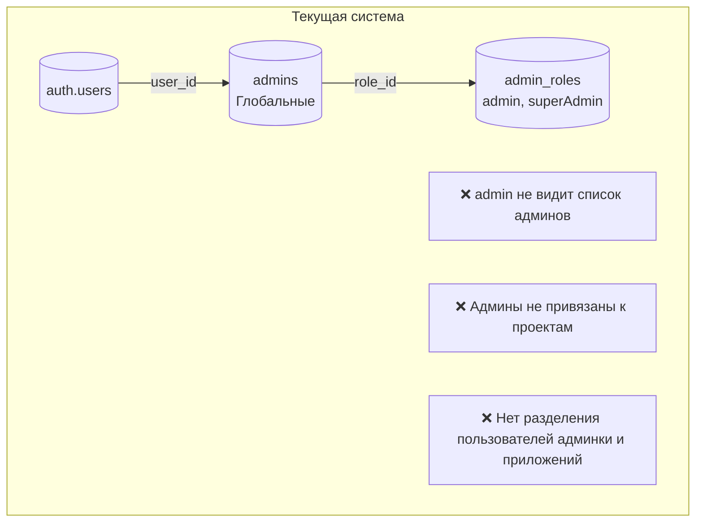

### Новая архитектура (решение)

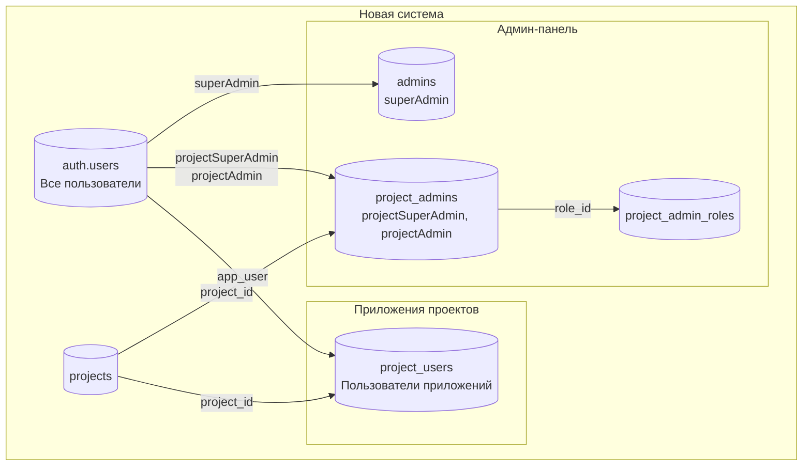

## 🔄 Поток авторизации

### В админ-панели

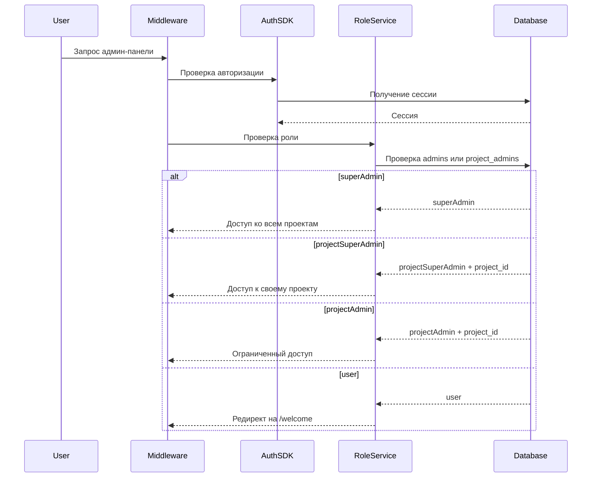

### В приложении проекта

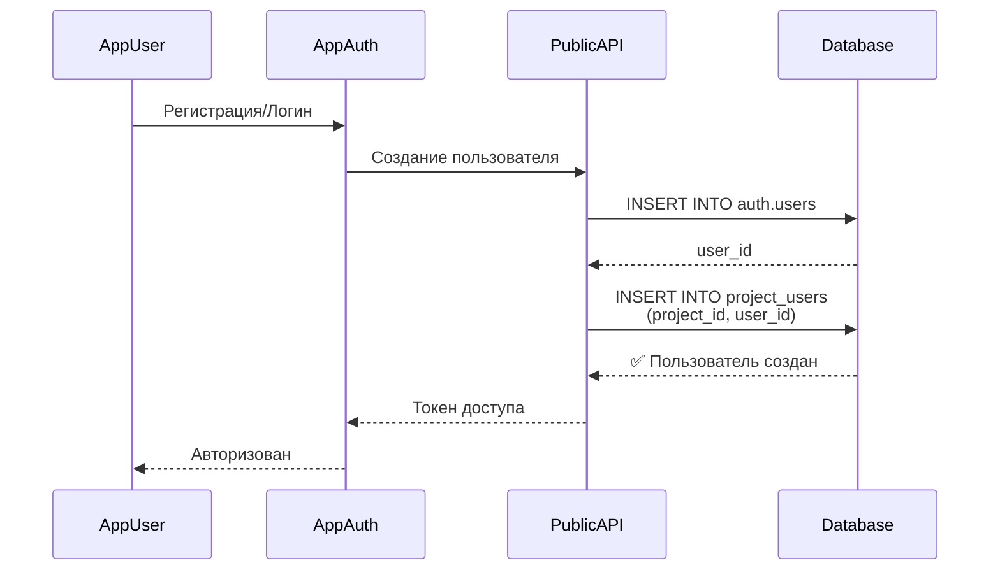

## 🏗️ Структура базы данных

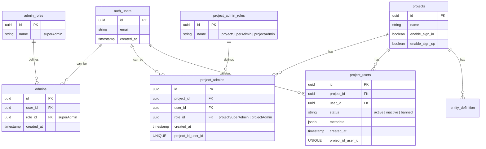

## 🛡️ Права доступа по ролям

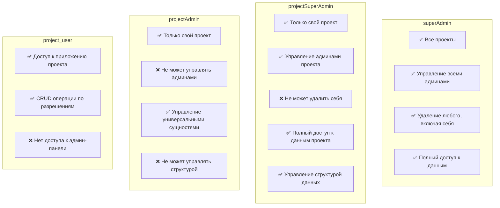

## 🔐 RLS политики (новые)

### project_admins

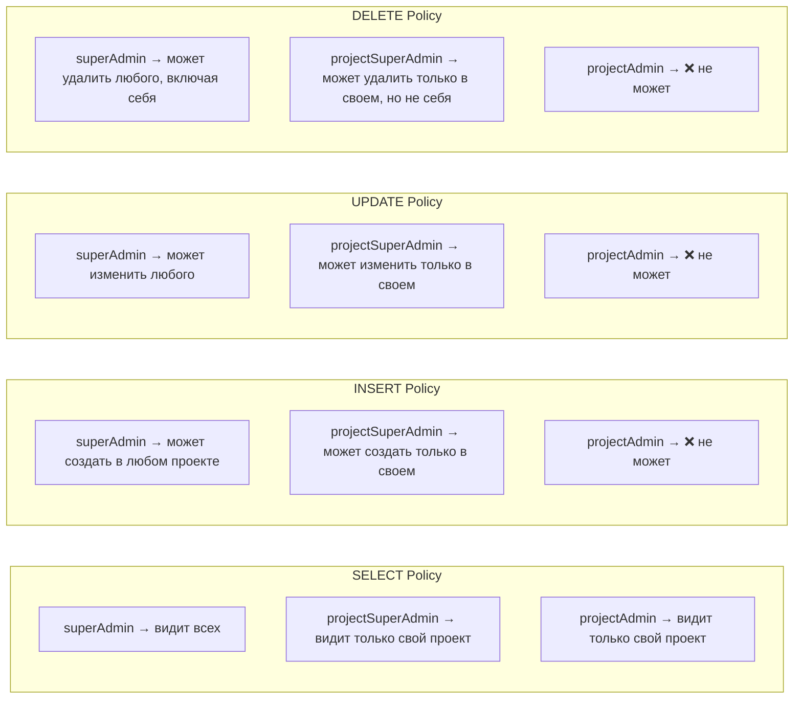

### project_users

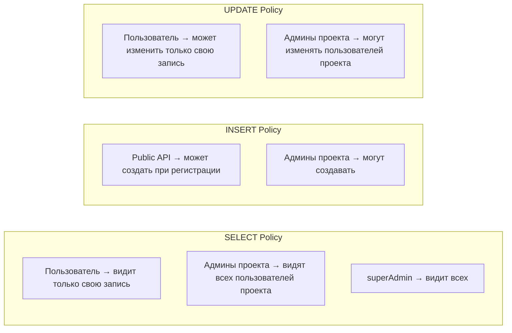

## 📱 Примеры использования

### Пример 1: SuperAdmin создает projectSuperAdmin

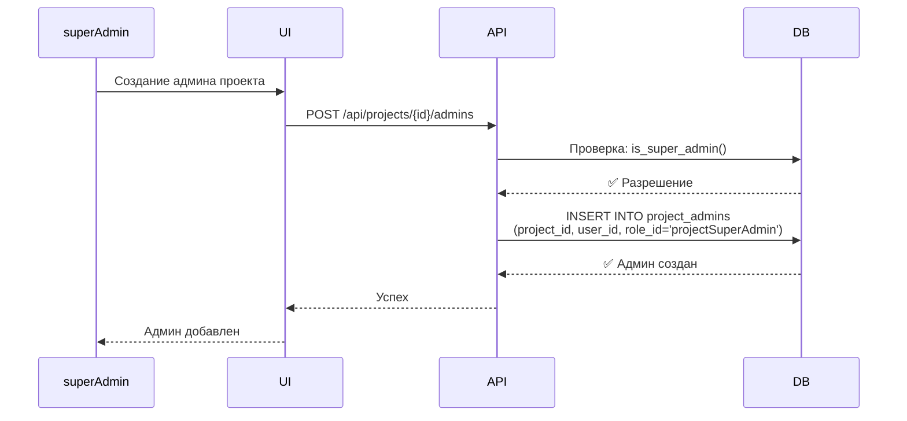

### Пример 2: ProjectSuperAdmin создает projectAdmin

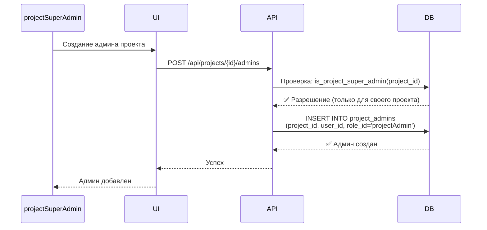

### Пример 3: Пользователь регистрируется в приложении проекта

#### Сценарий 3.1: Новый пользователь

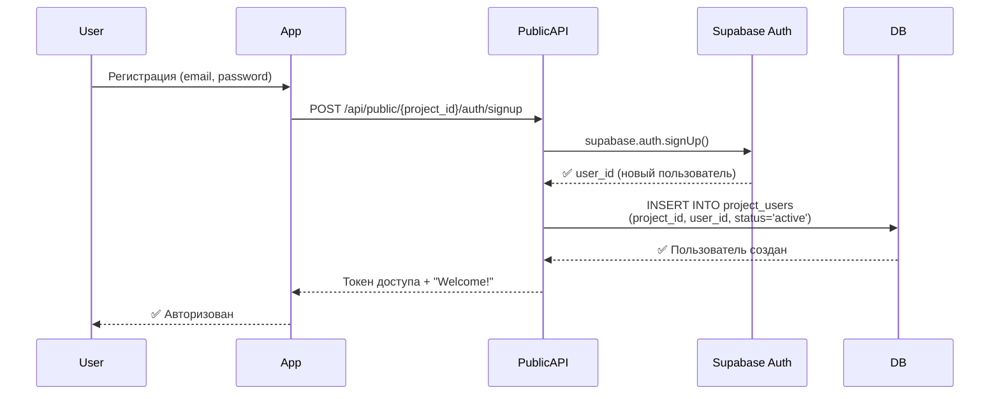

#### Сценарий 3.2: Пользователь уже существует (тот же email в другом проекте)

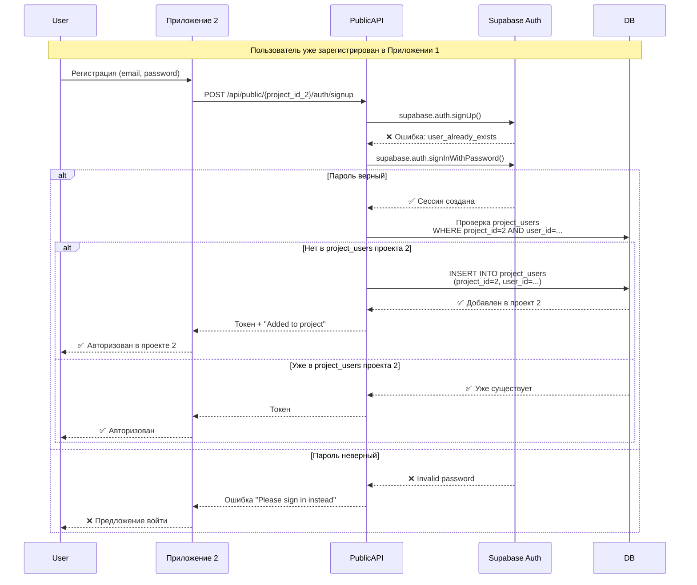

#### Сценарий 3.3: Визуализация состояния БД

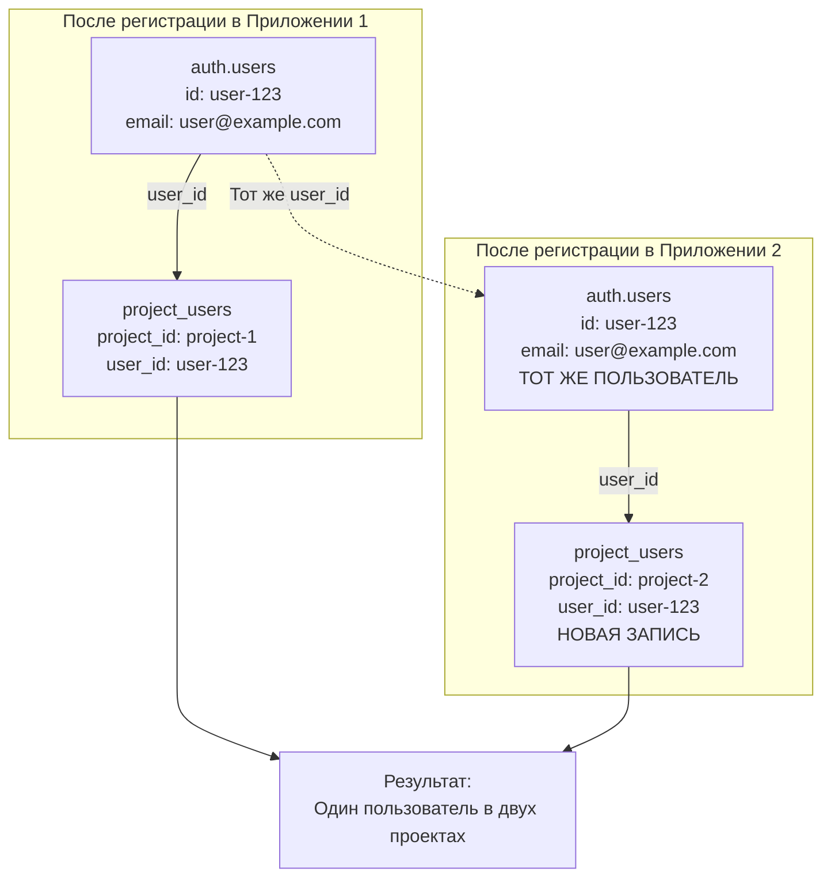

## 🔄 Миграция существующих данных

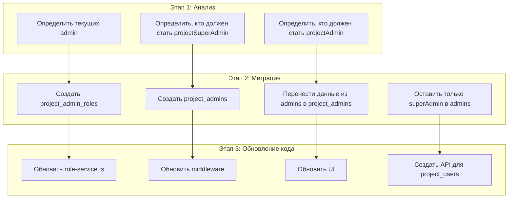

---

**Дата создания:** 2025-01-30  
**Версия:** 1.0
