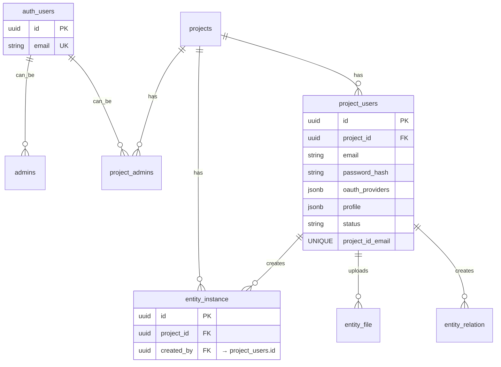

# Архитектура авторизации пользователей проектов

## 🎯 Критические требования

### Проблема с текущей архитектурой

**Текущая ситуация:**

- Используется `auth.users` (Supabase Auth) - один email = один пользователь
- `created_by` ссылается на `auth.users.id`
- Один пароль для всех проектов
- Один профиль для всех проектов

**Новые требования:**

1. ✅ **Разные пароли** для одного email в разных проектах
2. ✅ **Разные OAuth провайдеры** для одного email в разных проектах
3. ✅ **Разные профили** для одного email в разных проектах
4. ✅ **Связи через `project_users.id`**, а не `auth.users.id`

### Ограничения Supabase Auth

**Проблема:**

- Supabase Auth использует **email как уникальный идентификатор**
- Нельзя иметь разные пароли для одного email
- Нельзя иметь разные OAuth провайдеры для одного email в разных проектах
- `auth.users` - глобальная таблица, не привязана к проектам

---

## 🏗️ Решение: Гибридная архитектура

### Концепция

**Разделение контекстов:**

1. **Админ-панель** → использует `auth.users` (Supabase Auth)
2. **Приложения проектов** → используют `project_users` (кастомная авторизация)

### Архитектура

```
┌─────────────────────────────────────────────────────────┐
│                    АДМИН-ПАНЕЛЬ                         │
│  Использует: auth.users (Supabase Auth)                │
│  - superAdmin, projectSuperAdmin, projectAdmin        │
│  - Один email = один аккаунт                           │
└─────────────────────────────────────────────────────────┘

┌─────────────────────────────────────────────────────────┐
│              ПРИЛОЖЕНИЯ ПРОЕКТОВ                        │
│  Используют: project_users (кастомная авторизация)     │
│  - Пользователи приложений                             │
│  - Один email может иметь разные пароли в разных       │
│    проектах                                             │
│  - Разные профили для разных проектов                  │
└─────────────────────────────────────────────────────────┘
```

---

## 📊 Структура базы данных

### 1. Таблица `project_users` (основная для приложений)

```sql
CREATE TABLE IF NOT EXISTS public.project_users (
  id UUID DEFAULT gen_random_uuid() PRIMARY KEY,
  project_id UUID NOT NULL REFERENCES projects(id) ON DELETE CASCADE,

  -- Идентификация пользователя
  email TEXT NOT NULL,
  password_hash TEXT NOT NULL,  -- bcrypt hash пароля
  email_verified BOOLEAN DEFAULT false,

  -- OAuth провайдеры (для этого проекта)
  oauth_providers JSONB DEFAULT '{}'::jsonb,
  -- Формат: {"google": {"id": "...", "email": "..."}, "github": {...}}

  -- Профиль пользователя (для этого проекта)
  profile JSONB DEFAULT '{}'::jsonb,
  -- Формат: {"firstName": "...", "lastName": "...", "avatar": "...", ...}

  -- Статус
  status TEXT DEFAULT 'active' CHECK (status IN ('active', 'inactive', 'banned')),

  -- Метаданные
  metadata JSONB DEFAULT '{}'::jsonb,

  -- Временные метки
  created_at TIMESTAMPTZ DEFAULT NOW(),
  updated_at TIMESTAMPTZ DEFAULT NOW(),
  last_login_at TIMESTAMPTZ,

  -- Ограничения
  UNIQUE(project_id, email)  -- Один email = одна запись в проекте
);

-- Индексы
CREATE INDEX IF NOT EXISTS idx_project_users_project_id ON project_users(project_id);
CREATE INDEX IF NOT EXISTS idx_project_users_email ON project_users(email);
CREATE INDEX IF NOT EXISTS idx_project_users_project_email ON project_users(project_id, email);
CREATE INDEX IF NOT EXISTS idx_project_users_status ON project_users(status) WHERE status = 'active';

-- GIN индексы для JSONB
CREATE INDEX IF NOT EXISTS idx_project_users_oauth_providers_gin
  ON project_users USING GIN (oauth_providers);
CREATE INDEX IF NOT EXISTS idx_project_users_profile_gin
  ON project_users USING GIN (profile);
```

### 2. Обновление `entity_instance`

**Изменение:**

- `created_by` теперь ссылается на `project_users.id`, а не `auth.users.id`

```sql
-- Удаляем старое поле
ALTER TABLE entity_instance
  DROP COLUMN IF EXISTS created_by;

-- Добавляем новое поле
ALTER TABLE entity_instance
  ADD COLUMN created_by UUID REFERENCES project_users(id) ON DELETE SET NULL;

-- Индекс
CREATE INDEX IF NOT EXISTS idx_entity_instance_created_by
  ON entity_instance(created_by) WHERE created_by IS NOT NULL;

-- Комментарий
COMMENT ON COLUMN entity_instance.created_by IS
  'ID пользователя проекта из project_users, создавшего экземпляр';
```

### 3. Обновление других таблиц

**Таблицы, которые ссылаются на пользователей:**

- `entity_file` - файлы, загруженные пользователями
- `entity_relation` - связи, созданные пользователями
- Другие таблицы с `created_by`

**Миграция:**

```sql
-- Для каждой таблицы с created_by:
ALTER TABLE table_name
  DROP COLUMN IF EXISTS created_by;

ALTER TABLE table_name
  ADD COLUMN created_by UUID REFERENCES project_users(id) ON DELETE SET NULL;
```

---

## 🔐 Система авторизации

### Для админ-панели (без изменений)

**Используется:**

- `auth.users` (Supabase Auth)
- `admins` / `project_admins`
- Существующая логика через `role-service.ts`

### Для приложений проектов (новая система)

**Кастомная авторизация через `project_users`:**

#### 1. Регистрация

```typescript
// POST /api/public/[projectId]/auth/sign-up
async function signUp(
  projectId: string,
  data: {
    email: string;
    password: string;
    firstName?: string;
    lastName?: string;
    // ... другие поля профиля
  }
) {
  // 1. Проверяем, существует ли уже в project_users для этого проекта
  const existing = await supabase
    .from("project_users")
    .select("id")
    .eq("project_id", projectId)
    .eq("email", data.email)
    .single();

  if (existing) {
    throw new Error("User with this email already exists in this project");
  }

  // 2. Хешируем пароль (bcrypt)
  const passwordHash = await bcrypt.hash(data.password, 10);

  // 3. Создаем запись в project_users
  const { data: user, error } = await supabase
    .from("project_users")
    .insert({
      project_id: projectId,
      email: data.email,
      password_hash: passwordHash,
      profile: {
        firstName: data.firstName,
        lastName: data.lastName,
        // ... другие поля
      },
      status: "active",
    })
    .select()
    .single();

  if (error) throw error;

  // 4. Генерируем JWT токен (кастомный, не Supabase)
  const token = generateJWT({
    projectUserId: user.id,
    projectId: projectId,
    email: user.email,
  });

  return {
    token,
    user: {
      id: user.id,
      email: user.email,
      profile: user.profile,
    },
  };
}
```

#### 2. Вход

```typescript
// POST /api/public/[projectId]/auth/sign-in
async function signIn(
  projectId: string,
  data: {
    email: string;
    password: string;
  }
) {
  // 1. Находим пользователя в project_users для этого проекта
  const { data: user, error } = await supabase
    .from("project_users")
    .select("*")
    .eq("project_id", projectId)
    .eq("email", data.email)
    .eq("status", "active")
    .single();

  if (error || !user) {
    throw new Error("Invalid email or password");
  }

  // 2. Проверяем пароль
  const isValid = await bcrypt.compare(data.password, user.password_hash);
  if (!isValid) {
    throw new Error("Invalid email or password");
  }

  // 3. Обновляем last_login_at
  await supabase
    .from("project_users")
    .update({ last_login_at: new Date().toISOString() })
    .eq("id", user.id);

  // 4. Генерируем JWT токен
  const token = generateJWT({
    projectUserId: user.id,
    projectId: projectId,
    email: user.email,
  });

  return {
    token,
    user: {
      id: user.id,
      email: user.email,
      profile: user.profile,
    },
  };
}
```

#### 3. OAuth авторизация

```typescript
// POST /api/public/[projectId]/auth/oauth/[provider]
async function oauthSignIn(
  projectId: string,
  provider: "google" | "github",
  oauthData: {
    id: string;
    email: string;
    name?: string;
    avatar?: string;
  }
) {
  // 1. Проверяем, существует ли пользователь с таким email в project_users
  let user = await supabase
    .from("project_users")
    .select("*")
    .eq("project_id", projectId)
    .eq("email", oauthData.email)
    .single();

  if (!user) {
    // 2. Создаем нового пользователя
    const { data: newUser } = await supabase
      .from("project_users")
      .insert({
        project_id: projectId,
        email: oauthData.email,
        password_hash: "", // OAuth пользователи не имеют пароля
        oauth_providers: {
          [provider]: {
            id: oauthData.id,
            email: oauthData.email,
          },
        },
        profile: {
          firstName: oauthData.name?.split(" ")[0],
          lastName: oauthData.name?.split(" ")[1],
          avatar: oauthData.avatar,
        },
        status: "active",
        email_verified: true, // OAuth email уже подтвержден
      })
      .select()
      .single();

    user = newUser;
  } else {
    // 3. Обновляем OAuth провайдер
    const providers = user.oauth_providers || {};
    providers[provider] = {
      id: oauthData.id,
      email: oauthData.email,
    };

    await supabase
      .from("project_users")
      .update({
        oauth_providers: providers,
        last_login_at: new Date().toISOString(),
      })
      .eq("id", user.id);
  }

  // 4. Генерируем JWT токен
  const token = generateJWT({
    projectUserId: user.id,
    projectId: projectId,
    email: user.email,
  });

  return {
    token,
    user: {
      id: user.id,
      email: user.email,
      profile: user.profile,
    },
  };
}
```

---

## 🔑 JWT токены

### Структура токена

```typescript
interface ProjectUserJWT {
  projectUserId: string; // ID из project_users
  projectId: string; // ID проекта
  email: string;
  iat: number; // Issued at
  exp: number; // Expiration
}
```

### Генерация токена

```typescript
import jwt from "jsonwebtoken";

function generateJWT(payload: {
  projectUserId: string;
  projectId: string;
  email: string;
}): string {
  return jwt.sign(
    {
      projectUserId: payload.projectUserId,
      projectId: payload.projectId,
      email: payload.email,
    },
    process.env.JWT_SECRET!, // Отдельный секрет для приложений проектов
    {
      expiresIn: "7d", // 7 дней
    }
  );
}
```

### Верификация токена

```typescript
// Middleware для проверки авторизации в приложениях проектов
async function verifyProjectUserToken(
  token: string,
  projectId: string
): Promise<ProjectUserJWT | null> {
  try {
    const decoded = jwt.verify(
      token,
      process.env.JWT_SECRET!
    ) as ProjectUserJWT;

    // Проверяем, что токен для правильного проекта
    if (decoded.projectId !== projectId) {
      return null;
    }

    // Проверяем, что пользователь все еще активен
    const { data: user } = await supabase
      .from("project_users")
      .select("id, status")
      .eq("id", decoded.projectUserId)
      .eq("project_id", projectId)
      .single();

    if (!user || user.status !== "active") {
      return null;
    }

    return decoded;
  } catch (error) {
    return null;
  }
}
```

---

## 🔄 Обновление связей с сущностями

### Изменение `created_by` в коде

**Было:**

```typescript
// Использовали auth.users.id
const {
  data: { user },
} = await supabase.auth.getUser();
created_by: user?.id || null;
```

**Стало:**

```typescript
// Используем project_users.id из JWT токена
const projectUser = await verifyProjectUserToken(token, projectId);
created_by: projectUser?.projectUserId || null;
```

### Обновление SDK

```typescript
// lib/sdk/public-api/client.ts
async createInstance(
  entityDefinitionId: string,
  data: CreateInstanceData
): Promise<EntityInstanceWithFields> {
  // 1. Получаем projectUserId из токена (не из auth.users)
  const projectUser = await this.getProjectUserFromToken();

  if (!projectUser) {
    throw new Error('Unauthorized');
  }

  // 2. Создаем экземпляр с project_users.id
  const { data: instance, error } = await this.supabase
    .from('entity_instance')
    .insert({
      entity_definition_id: entityDefinitionId,
      project_id: this.projectId,
      data: instanceData,
      created_by: projectUser.projectUserId,  // Используем project_users.id
    })
    .select()
    .single();

  // ...
}
```

---

## 📋 RLS политики для project_users

```sql
-- Включение RLS
ALTER TABLE project_users ENABLE ROW LEVEL SECURITY;

-- Политика: Пользователь может видеть только свою запись
CREATE POLICY "Users can view own project_user record"
  ON project_users
  FOR SELECT
  USING (
    -- Проверяем через JWT токен (реализуется через функцию)
    -- Или через кастомную проверку в API
    id = current_project_user_id()
  );

-- Политика: Админы проекта могут видеть всех пользователей проекта
CREATE POLICY "Project admins can view all project users"
  ON project_users
  FOR SELECT
  USING (
    -- Проверяем через project_admins
    EXISTS (
      SELECT 1 FROM project_admins
      WHERE project_admins.project_id = project_users.project_id
        AND project_admins.user_id = auth.uid()  -- Для админки используется auth.users
    )
  );

-- Политика: Пользователь может обновлять только свой профиль
CREATE POLICY "Users can update own profile"
  ON project_users
  FOR UPDATE
  USING (id = current_project_user_id())
  WITH CHECK (id = current_project_user_id());

-- Политика: Публичная регистрация (через API)
-- RLS не применяется, проверка через API endpoint
```

---

## 🔄 Миграция существующих данных

### Если уже есть пользователи в auth.users

**Вариант 1: Перенос в project_users**

```sql
-- Для каждого проекта создаем project_users из auth.users
INSERT INTO project_users (
  project_id,
  email,
  password_hash,  -- Нужно получить из auth.users (если возможно)
  profile,
  status
)
SELECT
  'project-id-here',
  au.email,
  '',  -- Пароль нужно запросить у пользователя
  jsonb_build_object(
    'firstName', p.first_name,
    'lastName', p.last_name,
    'avatar', p.avatar_url
  ),
  'active'
FROM auth.users au
LEFT JOIN profiles p ON p.id = au.id
WHERE au.email IS NOT NULL;
```

**Вариант 2: Гибридный подход**

- Оставляем существующих пользователей в auth.users
- Новые пользователи создаются в project_users
- Постепенная миграция

---

## 📊 Схема новой архитектуры



---

## ✅ Преимущества новой архитектуры

1. ✅ **Разные пароли** - каждый проект имеет свой пароль для одного email
2. ✅ **Разные OAuth провайдеры** - можно использовать Google в одном проекте, GitHub в другом
3. ✅ **Разные профили** - профиль хранится в `project_users.profile` для каждого проекта
4. ✅ **Изоляция проектов** - пользователи проектов полностью изолированы
5. ✅ **Гибкость** - можно настроить разные правила для разных проектов

---

## ⚠️ Важные моменты

### 1. Безопасность паролей

- ✅ Используем `bcrypt` для хеширования паролей
- ✅ Никогда не храним пароли в открытом виде
- ✅ Минимальная длина пароля: 8 символов
- ✅ Рекомендуется: требовать сложные пароли

### 2. JWT токены

- ✅ Используем отдельный `JWT_SECRET` для приложений проектов
- ✅ Короткое время жизни токенов (7 дней)
- ✅ Refresh tokens для обновления токенов
- ✅ Проверка статуса пользователя при каждом запросе

### 3. OAuth провайдеры

- ✅ Храним OAuth данные в `oauth_providers` JSONB
- ✅ Поддержка нескольких провайдеров для одного пользователя
- ✅ Верификация email через OAuth

### 4. Миграция

- ⚠️ Нужно обновить все `created_by` ссылки
- ⚠️ Нужно обновить RLS политики
- ⚠️ Нужно обновить SDK и API endpoints

---

## ❓ Вопросы для обсуждения

1. **Подтверждаете гибридный подход?** (auth.users для админки, project_users для приложений)
2. **JWT токены** - используем кастомные JWT или Supabase JWT с модификациями?
3. **Миграция существующих данных** - как обрабатывать пользователей, которые уже есть в auth.users?
4. **OAuth провайдеры** - какие провайдеры поддерживаем? (Google, GitHub, Facebook, и т.д.)
5. **Восстановление пароля** - как реализуем для project_users?

---

**Дата создания:** 2025-01-30  
**Статус:** На обсуждении
