# Визуализация архитектуры пользователей проектов

## 📊 Сравнение архитектур

### Старая архитектура (проблемы)

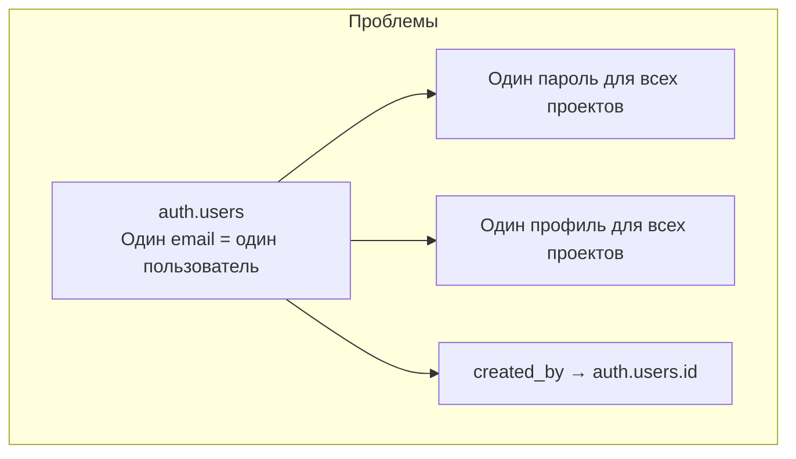

### Новая архитектура (решение)

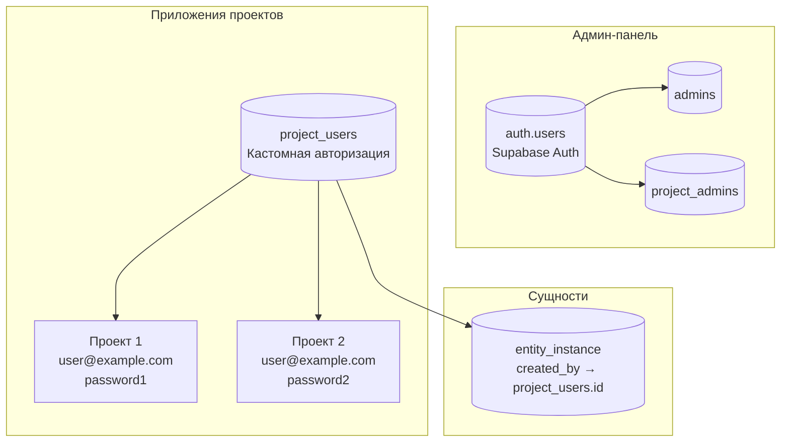

## 🔄 Поток авторизации

### В админ-панели (без изменений)

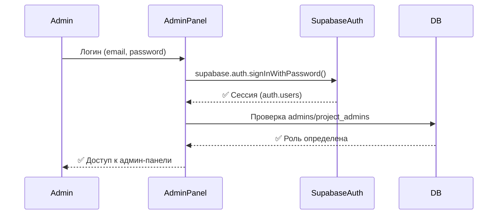

### В приложении проекта (новая система)

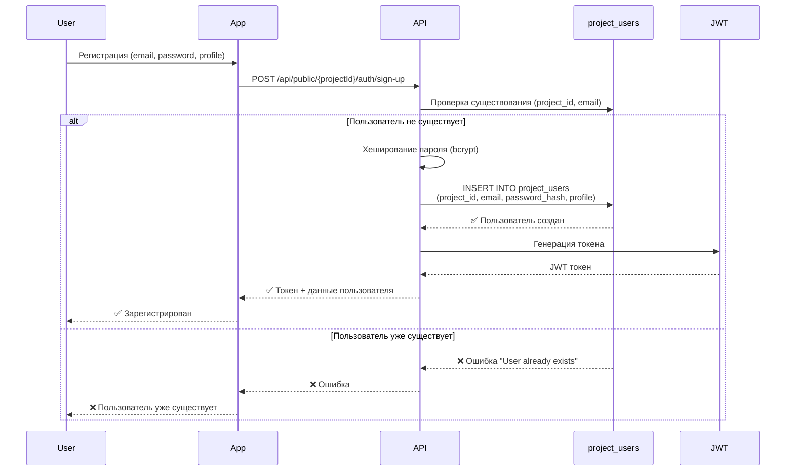

### Вход в приложение проекта

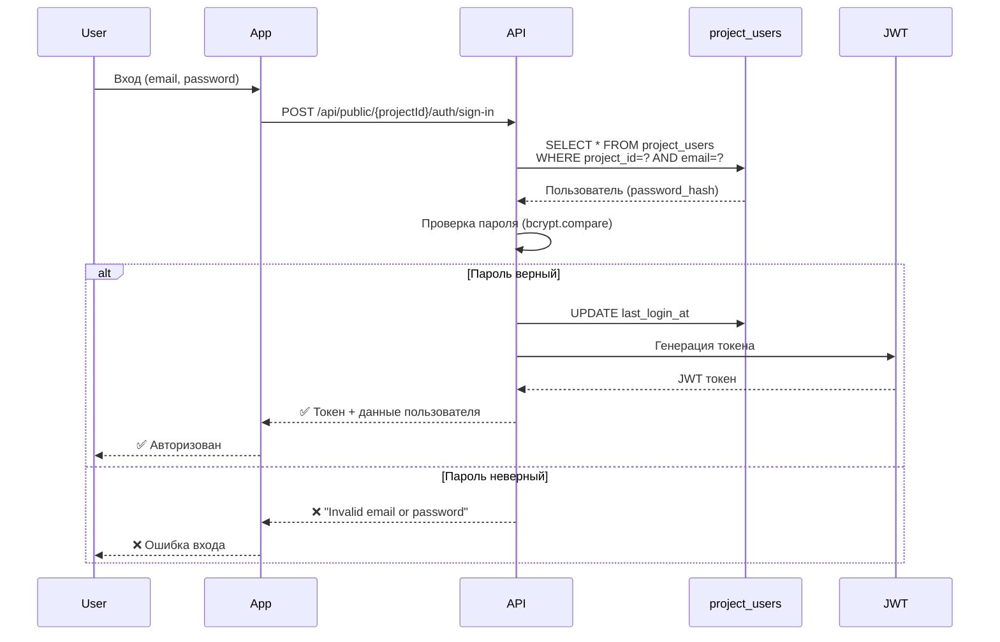

## 🏗️ Структура данных

### project_users таблица

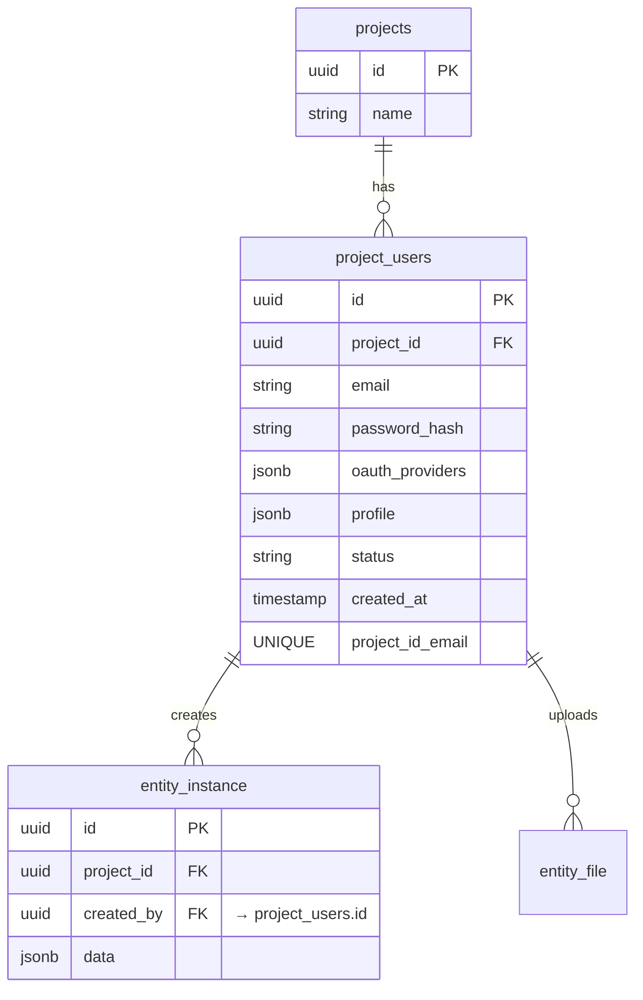

### Пример данных

#### Проект 1: Магазин

```json
{
  "id": "user-123",
  "project_id": "project-shop",
  "email": "john@example.com",
  "password_hash": "$2b$10$...",
  "oauth_providers": {
    "google": {
      "id": "google-123",
      "email": "john@example.com"
    }
  },
  "profile": {
    "firstName": "John",
    "lastName": "Doe",
    "avatar": "https://...",
    "phone": "+1234567890",
    "address": "123 Main St"
  },
  "status": "active"
}
```

#### Проект 2: Блог (тот же email, другой профиль)

```json
{
  "id": "user-456",
  "project_id": "project-blog",
  "email": "john@example.com",
  "password_hash": "$2b$10$...", // ДРУГОЙ пароль!
  "oauth_providers": {
    "github": {
      "id": "github-456",
      "email": "john@example.com"
    }
  },
  "profile": {
    "firstName": "Johnny",
    "lastName": "Smith",
    "avatar": "https://...",
    "bio": "Blogger and writer",
    "website": "https://johnny.blog"
  },
  "status": "active"
}
```

## 🔐 JWT токен структура

```mermaid
graph LR
    subgraph "JWT Payload"
        P1[projectUserId<br/>user-123]
        P2[projectId<br/>project-shop]
        P3[email<br/>john@example.com]
        P4[iat<br/>timestamp]
        P5[exp<br/>timestamp]
    end

    subgraph "Подпись"
        S1[JWT_SECRET]
        S2[HMAC SHA256]
    end

    P1 --> S1
    P2 --> S1
    P3 --> S1
    S1 --> S2
    S2 --> Token[JWT Token]
```

## 🔄 Создание сущности с project_users.id

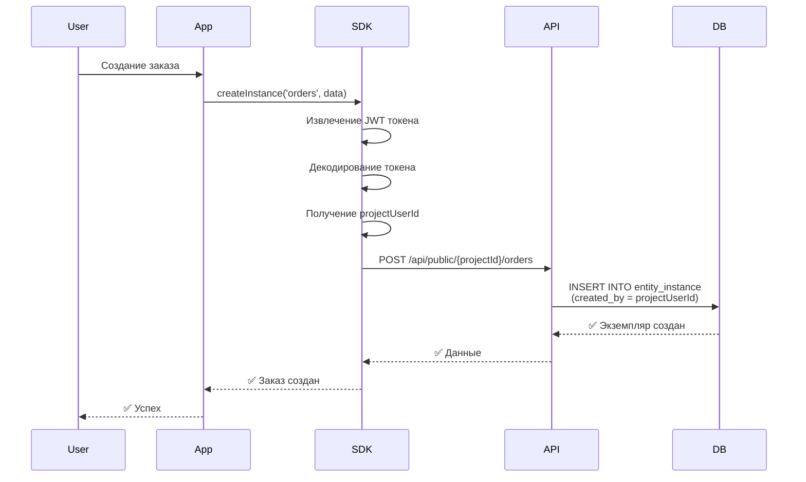

## 📊 Сравнение подходов

### Старый подход (auth.users)

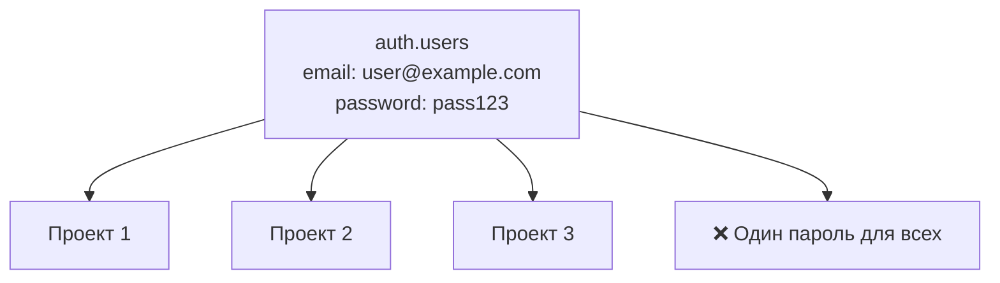

### Новый подход (project_users)

```mermaid
graph TB
    subgraph "Проект 1"
        PU1[project_users<br/>email: user@example.com<br/>password: pass1<br/>profile: {...}]
    end

    subgraph "Проект 2"
        PU2[project_users<br/>email: user@example.com<br/>password: pass2<br/>profile: {...}]
    end

    subgraph "Проект 3"
        PU3[project_users<br/>email: user@example.com<br/>password: pass3<br/>profile: {...}]
    end

    Benefit[✅ Разные пароли и профили]
    PU1 --> Benefit
    PU2 --> Benefit
    PU3 --> Benefit
```

## 🔄 OAuth авторизация

### Google OAuth в Проекте 1

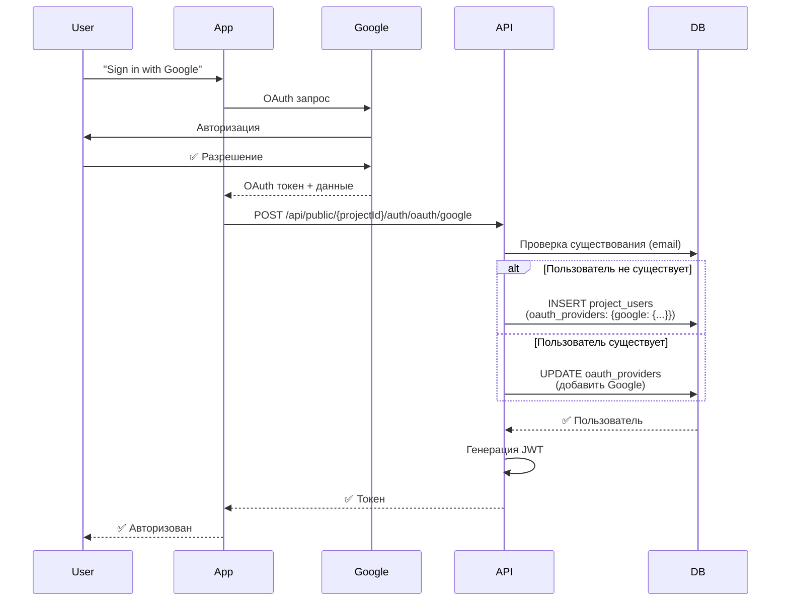

### GitHub OAuth в Проекте 2 (тот же email)

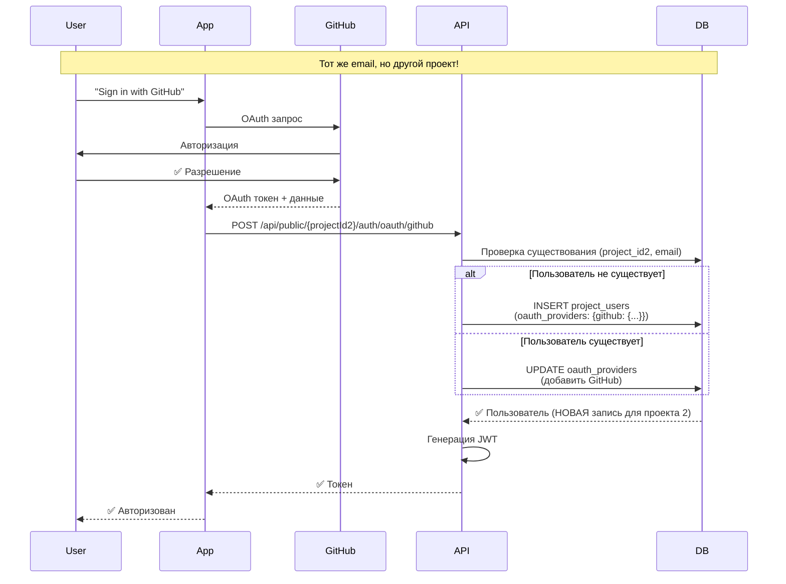

## 🔐 Безопасность

### Хеширование паролей

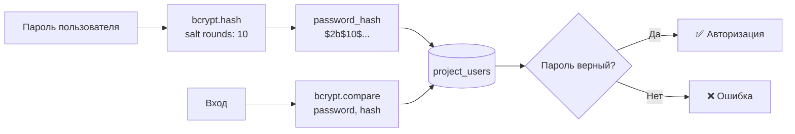

### JWT токены

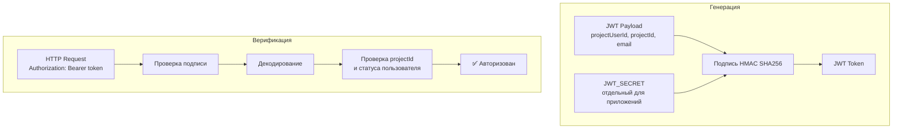

## 📋 Миграция данных

### Сценарий миграции

```mermaid
graph TB
    subgraph "До миграции"
        AU[auth.users<br/>user@example.com]
        EI1[entity_instance<br/>created_by → auth.users.id]
        EI2[entity_instance<br/>created_by → auth.users.id]
        AU --> EI1
        AU --> EI2
    end

    subgraph "Миграция"
        M1[Создание project_users<br/>для каждого проекта]
        M2[Обновление created_by<br/>→ project_users.id]
        M3[Обновление RLS политик]
    end

    subgraph "После миграции"
        PU1[project_users<br/>Проект 1]
        PU2[project_users<br/>Проект 2]
        EI3[entity_instance<br/>created_by → project_users.id]
        PU1 --> EI3
        PU2 --> EI3
    end

    AU --> M1
    EI1 --> M2
    EI2 --> M2
    M1 --> PU1
    M1 --> PU2
    M2 --> EI3
    M2 --> M3
```

---

**Дата создания:** 2025-01-30  
**Версия:** 1.0
