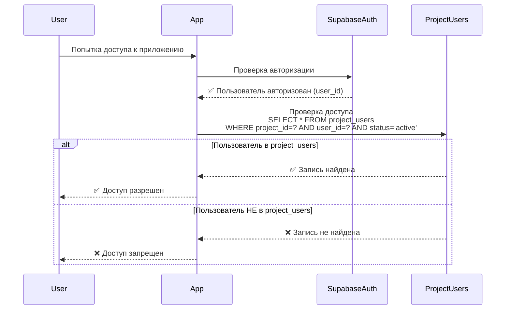

# Анализ концепции project_users

## 🎯 Основные принципы

### 1. Авторизация через Supabase Auth

- ✅ Все пользователи авторизуются через `auth.users` (Supabase Auth)
- ✅ Один email = один аккаунт в системе
- ✅ Один профиль для всех проектов (таблица `profiles`)

### 2. Профили

- ✅ **Один профиль** расшарен по всем приложениям и админ-панели
- ✅ Профиль хранится в `profiles` (связан с `auth.users.id`)
- ❌ НЕ нужны разные профили для разных проектов

---

## 📋 Анализ сценариев использования project_users

### Сценарий 1: Ограничения доступа к сущностям на основе связи

**Описание:**

- У проекта есть ограничения доступа к каким-то сущностям на основе связи пользователя с другой сущностью
- Например: пользователь может видеть заказы только своей компании

**Анализ:**

- ❌ Это **НЕ** задача `project_users`
- ✅ Это задача **отдельной таблицы связей** (например, `user_company`, `user_organization`)
- ✅ Проверка доступа через отдельную функцию в RLS политиках

**Решение:**

```sql
-- Отдельная таблица для связей
CREATE TABLE user_company (
  user_id UUID REFERENCES auth.users(id),
  company_id UUID REFERENCES entity_instance(id),
  role TEXT,  -- 'member', 'admin', etc.
  UNIQUE(user_id, company_id)
);

-- В RLS политике проверяем через JOIN
CREATE POLICY "Users can view orders of their company"
  ON entity_instance FOR SELECT
  USING (
    entity_definition_id = 'orders-id'
    AND (
      -- Админ видит все
      is_admin(auth.uid())
      OR
      -- Пользователь видит заказы своей компании
      EXISTS (
        SELECT 1 FROM user_company uc
        JOIN entity_instance company ON uc.company_id = company.id
        WHERE uc.user_id = auth.uid()
          AND entity_instance.data->>'company_id' = company.id::text
      )
    )
  );
```

**Вывод:** `project_users` НЕ нужна для этого сценария.

---

### Сценарий 2: Пользователь делает заказ

**Описание:**

- Пользователь создает заказ → создается в `entity_instance`
- Админ видит все заказы
- Пользователь видит только свои заказы через политики доступа (Owner|Admin)

**Анализ:**

- ✅ Это уже реализовано через `created_by` в `entity_instance`
- ✅ RLS политики используют `Owner|Admin` для проверки
- ✅ Функция `check_permission` проверяет владельца через `created_by`

**Текущая реализация:**

```sql
-- entity_instance.created_by → auth.users.id
-- RLS политика:
CREATE POLICY "View orders"
  ON entity_instance FOR SELECT
  USING (
    check_permission(
      'Owner|Admin',  -- read_permission
      auth.uid(),
      entity_instance.created_by  -- owner_id
    )
  );
```

**Вывод:** `project_users` НЕ нужна для этого сценария. Достаточно `created_by`.

---

### Сценарий 3: Приложение без регистрации (только авторизация)

**Описание:**

- Приложение доступно только пользователям с токеном
- У приложения **нет регистрации**, только авторизация
- Админ может добавить пользователя в таблицу пользователей приложения или удалить его
- Пользователь может авторизоваться в Supabase, но **не должен получить доступ к приложению** без записи в таблице

**Анализ:**

- ✅ Это **основная задача** `project_users`!
- ✅ `project_users` = **whitelist** пользователей, которые имеют доступ к проекту
- ✅ Если пользователя нет в `project_users` для проекта → нет доступа к приложению

**Решение:**

```sql
CREATE TABLE project_users (
  id UUID PRIMARY KEY,
  project_id UUID REFERENCES projects(id) ON DELETE CASCADE,
  user_id UUID REFERENCES auth.users(id) ON DELETE CASCADE,
  created_at TIMESTAMPTZ DEFAULT NOW(),
  created_by UUID REFERENCES auth.users(id),  -- Кто добавил (админ)
  status TEXT DEFAULT 'active' CHECK (status IN ('active', 'inactive', 'banned')),
  UNIQUE(project_id, user_id)  -- Один пользователь = одна запись в проекте
);
```

**Логика доступа:**

```typescript
// При запросе к приложению проекта
async function checkProjectAccess(
  projectId: string,
  userId: string
): Promise<boolean> {
  const { data } = await supabase
    .from("project_users")
    .select("id, status")
    .eq("project_id", projectId)
    .eq("user_id", userId)
    .eq("status", "active")
    .single();

  return !!data; // Доступ только если есть активная запись
}
```

**Вывод:** `project_users` **НУЖНА** для этого сценария.

---

## 🎯 Рекомендуемая концепция project_users

### Назначение таблицы

**`project_users` - это whitelist пользователей для доступа к приложению проекта**

**Ключевые моменты:**

1. ✅ Контроль доступа к приложению проекта
2. ✅ Админ может добавлять/удалять пользователей
3. ✅ Пользователь может авторизоваться в Supabase, но без записи в `project_users` не получит доступ
4. ❌ НЕ для хранения профилей (профиль в `profiles`)
5. ❌ НЕ для хранения паролей (пароли в `auth.users`)
6. ❌ НЕ для связей с сущностями (используем `created_by` или отдельные таблицы связей)

### Структура таблицы

```sql
CREATE TABLE project_users (
  id UUID PRIMARY KEY DEFAULT gen_random_uuid(),
  project_id UUID NOT NULL REFERENCES projects(id) ON DELETE CASCADE,
  user_id UUID NOT NULL REFERENCES auth.users(id) ON DELETE CASCADE,

  -- Статус доступа
  status TEXT DEFAULT 'active' CHECK (status IN ('active', 'inactive', 'banned')),

  -- Метаданные
  created_at TIMESTAMPTZ DEFAULT NOW(),
  created_by UUID REFERENCES auth.users(id),  -- Кто добавил (админ)
  updated_at TIMESTAMPTZ DEFAULT NOW(),

  -- Ограничения
  UNIQUE(project_id, user_id)  -- Один пользователь = одна запись в проекте
);

-- Индексы
CREATE INDEX idx_project_users_project_id ON project_users(project_id);
CREATE INDEX idx_project_users_user_id ON project_users(user_id);
CREATE INDEX idx_project_users_status ON project_users(status) WHERE status = 'active';
```

### Поток авторизации



---

## 📊 Сравнение сценариев

| Сценарий                        | Нужна project_users? | Альтернатива                                    |
| ------------------------------- | -------------------- | ----------------------------------------------- |
| Ограничения доступа через связи | ❌ Нет               | Отдельная таблица связей (user_company, и т.д.) |
| Пользователь видит свои заказы  | ❌ Нет               | `created_by` + RLS политики (Owner\|Admin)      |
| Приложение без регистрации      | ✅ **Да**            | `project_users` как whitelist                   |
| Разные профили для проектов     | ❌ Нет               | Один профиль в `profiles`                       |
| Разные пароли для проектов      | ❌ Нет               | Один пароль в `auth.users`                      |

---

## 🔄 Дополнительные сценарии

### Сценарий 4: Приложение с регистрацией

**Описание:**

- Приложение **имеет регистрацию**
- Пользователь регистрируется → автоматически добавляется в `project_users`

**Решение:**

```typescript
// При регистрации в приложении проекта
async function signUp(projectId: string, email: string, password: string) {
  // 1. Создаем пользователя в Supabase Auth
  const {
    data: { user },
  } = await supabase.auth.signUp({
    email,
    password,
  });

  // 2. Автоматически добавляем в project_users
  await supabase.from("project_users").insert({
    project_id: projectId,
    user_id: user.id,
    status: "active",
  });

  return user;
}
```

**Вывод:** `project_users` нужна, но запись создается автоматически при регистрации.

---

### Сценарий 5: Гибридное приложение

**Описание:**

- Приложение может работать в двух режимах:
  - С регистрацией (автоматическое добавление в `project_users`)
  - Без регистрации (только админ добавляет в `project_users`)

**Решение:**

```sql
-- Добавляем настройку в projects
ALTER TABLE projects
ADD COLUMN allow_public_registration BOOLEAN DEFAULT false;
```

```typescript
async function signUp(projectId: string, email: string, password: string) {
  // Проверяем настройку проекта
  const { data: project } = await supabase
    .from("projects")
    .select("allow_public_registration")
    .eq("id", projectId)
    .single();

  if (!project?.allow_public_registration) {
    throw new Error("Registration is not allowed for this project");
  }

  // Регистрация + автоматическое добавление в project_users
  // ...
}
```

**Вывод:** `project_users` нужна, логика зависит от настройки проекта.

---

## ✅ Итоговые рекомендации

### 1. Структура project_users

**Минимальная структура:**

```sql
project_users (
  id UUID PRIMARY KEY,
  project_id UUID → projects,
  user_id UUID → auth.users,
  status TEXT DEFAULT 'active',
  created_at TIMESTAMPTZ,
  created_by UUID → auth.users,  -- Кто добавил (опционально)
  UNIQUE(project_id, user_id)
)
```

**НЕ нужны:**

- ❌ `password_hash` (пароли в `auth.users`)
- ❌ `profile` (профиль в `profiles`)
- ❌ `oauth_providers` (OAuth через Supabase Auth)

### 2. Назначение

**`project_users` = whitelist для доступа к приложению проекта**

- ✅ Контроль доступа к приложению
- ✅ Админ управляет списком пользователей
- ✅ Поддержка приложений без регистрации
- ✅ Поддержка приложений с регистрацией (автоматическое добавление)

### 3. Проверка доступа

```typescript
// Middleware для проверки доступа к приложению проекта
async function requireProjectAccess(
  projectId: string,
  userId: string
): Promise<void> {
  const { data } = await supabase
    .from("project_users")
    .select("id")
    .eq("project_id", projectId)
    .eq("user_id", userId)
    .eq("status", "active")
    .single();

  if (!data) {
    throw new Error("Access denied: User is not authorized for this project");
  }
}
```

### 4. Связи с сущностями

**Используем `created_by` → `auth.users.id` (НЕ `project_users.id`)**

**Почему:**

- `created_by` должен ссылаться на реального пользователя (`auth.users.id`)
- `project_users` - это только whitelist, не идентификатор пользователя
- RLS политики используют `auth.uid()` для проверки владельца

---

## ❓ Вопросы для уточнения

1. **Подтверждаете концепцию?** `project_users` = whitelist для доступа к приложению
2. **Связи с сущностями:** Используем `created_by` → `auth.users.id` или `project_users.id`?
3. **Автоматическое добавление:** При регистрации в приложении автоматически добавлять в `project_users`?
4. **Настройка проекта:** Нужна ли настройка `allow_public_registration` в `projects`?

---

**Дата создания:** 2025-01-30  
**Статус:** На обсуждении
